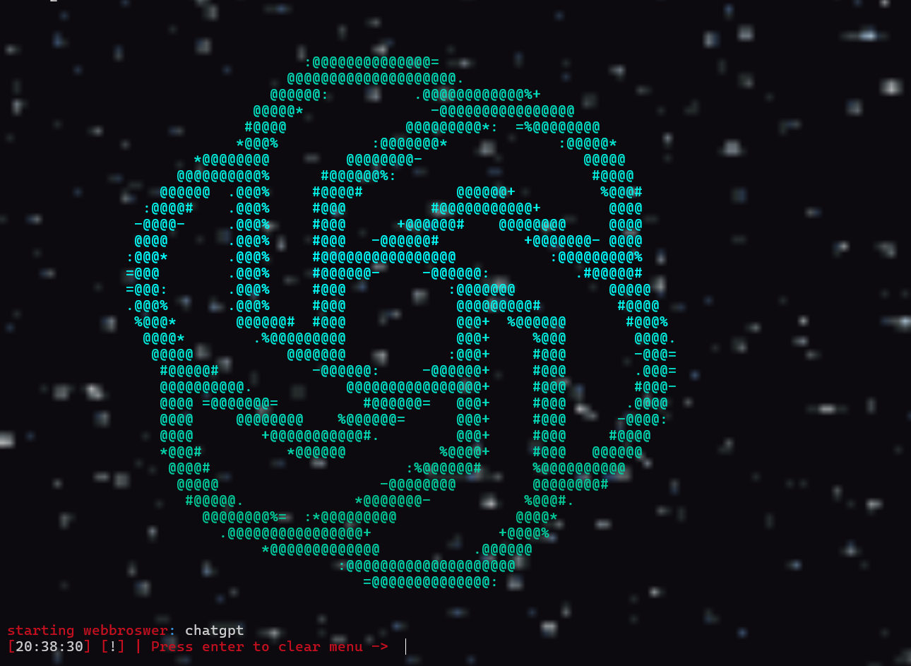

<div align="center">
  

  # 🧊 CYAN TOOL
  _An aesthetic terminal-based productivity toolkit for students and developers._

  
  
  
</div>

---

## 🚀 Features

### 📁 General Tools
- 🔹 [01] Google Classroom
- 🔹 [02] ChatGPT (Web Version)
- 🔹 [03] GitHub
- 🔹 [04] YouTube
- 🔹 [05] Calendar
- 🔹 [06] YouTube to MP3/MP4

### 📚 Study Tools
- 🔹 [07] Alarm
- 🔹 [08] Google Calendar
- 🔹 [09] Dictionary & Thesaurus
- 🔹 [10] Flashcards
- 🔹 [11] AI Chatbot (Inbuilt)
- 🔹 [12] Notes
- 🔹 [13] Essay Structure Guide

### ⚙️ Utilities
- 🔹 [14] Random Fact of the Day
- 🔹 [15] Math Solver
- 🔹 [16] Terminal Wallpaper Changer
- 🔹 [17] Physics Formula Sheet
- 🔹 [18] Spelling & Grammar Check
- 🔹 [19] Recommended Study Websites

---

## 🎨 Feature Preview

> 

**Retro terminal vibe with neon aesthetics and clear category separation.**

---

## 🛠️ Installation

```bash/cmd
https://github.com/Airstriker123/Cyan.git
cd cyan-tool
start setup.bat

